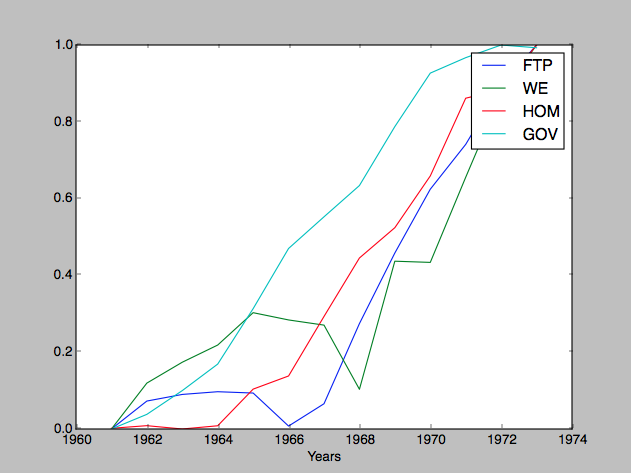

# Homework 2 Programming Part

## Part A

I used the `pearsonr` function to get the correlation between homicide rate and all the other factors. I ended up determiniming that `GOV` had the greatest influence because the `pearsonr` correlation factor was the highest. To run the function:

	python 2a.py

The results are as follows:

| Column    | Pearsonr Coefficient   |
| ----- | --------------- |
| UEMP | 0.21014174585806875 | 0.49076686344682885 |
| MAN | 0.54642268793308635 | 0.053341733728136047 |
| LIC | 0.72630540041622227 | 0.0049312511726717981 |
| GR | 0.81628727259413125 | 0.00066418184428171866 |
| NMAN | 0.95593474270226997 | 3.4106187302865251e-07 |
| GOV | 0.95805455979551823 | 2.6112711142666157e-07 |
| HE | 0.91340626501869626 | 1.2894523436469096e-05 |
| WE | 0.88815258210630621 | 5.0114380369048699e-05 |

I included a picture of the graph of the `GOV` column so you can see that it's most highly correlated with `WE`, `FTP` and `HOM`.

## Part B

I created an executable `process` which can be run to pre-process the data. It fills in gaps and normalizes the data using znorm. Run it like so:

	./processed crx.data.training crx.data.testing

This will output two files `crx.training.processed` and `crx.testing.processed`. 

Next feed this into the knn algorithm with k = 3.

	./run 3 crx.testing.processed crx.training.processed

This will produce a file `testing_k3` which can be piped into the program `accuracy.pl` to get the percent correct.

	cat testing_k3 | perl accuracy.pl

The results from 1 <= k <= 10 for `crx.testing.processed` are in the file `results.csv` and listed below:

| K     | Accuracy Rate   |
| ----- | --------------- |
| 1 | 0.826086956521739 |
| 2 | 0.826086956521739 |
| 3 | 0.855072463768116 |
| 4 | 0.847826086956522 |
| 5 | 0.847826086956522 |
| 6 | 0.869565217391304 |
| 7 | 0.847826086956522 |
| 8 | 0.833333333333333 |
| 9 | 0.86231884057971 |
| 10 | 0.847826086956522 |